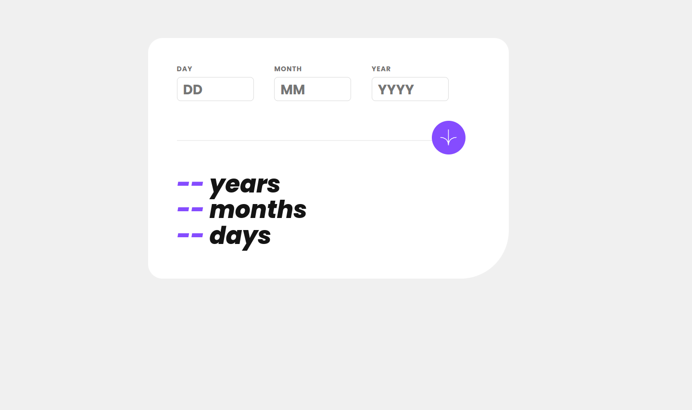
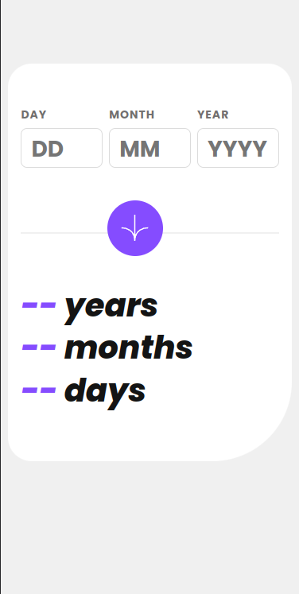

# Age Calculator App
This is a simple age calculator application developed as a practice project to enhance my web development skills. The application allows users to calculate their age based on the input of their birthdate.

## Age Calculator App

---

# Features
User-friendly interface.
Input validation to ensure correct date format.
Real-time calculation of the user's age.
Clear button to reset the input fields.

# Technologies Used
- HTML
- CSS
- JavaScript
- React JS

# Demo
You can visit the project clicking [demo-link](https://www.example.com)

# License
This project is licensed under the MIT License. Feel free to modify and use it according to your needs.

# Contact
If you have any questions, suggestions, or would like to connect, you can reach me at ftorocastilla@gmail.com.